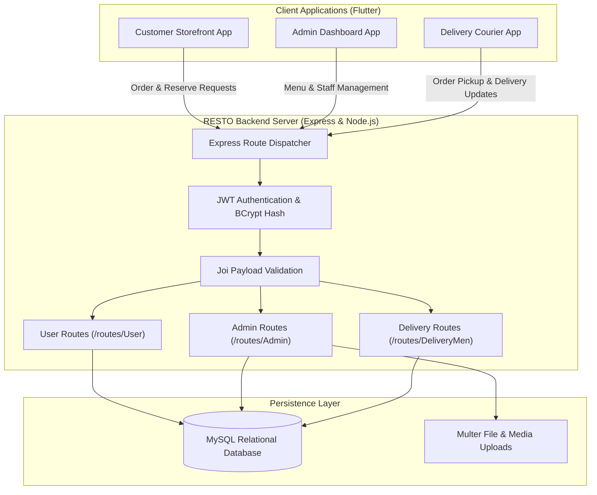

# RESTO: Multi-Tier Restaurant Management & Order Dispatch Ecosystem

An enterprise restaurant management platform comprising an Express/Node.js backend, a normalized MySQL relational database, and cross-platform client interfaces tailored for three distinct user roles: **Customers (Users)**, **Store Administrators**, and **Delivery Personnel**.

---

## Table of Contents

- [Architecture & System Overview](#architecture--system-overview)
- [Features](#features)
- [Tech Stack](#tech-stack)
- [Database Architecture](#database-architecture)
- [Project Structure](#project-structure)
- [Installation & Setup](#installation--setup)
- [Documentation](#documentation)
- [Author](#author)

---

## Architecture & System Overview

The platform coordinates operations between customer storefront ordering, table reservations, administrative inventory oversight, and delivery fleet dispatching:



---

## Features

### 1. Customer Interface (`routes/User`)
- **Digital Menu Browsing**: Categorized food items, dietary tags, descriptions, and dynamic pricing.
- **Cart & Order Processing**: Real-time checkout, cart persistence, and order tracking.
- **Table Reservation System**: Table booking with timestamps, party size selection, and conflict prevention.

### 2. Administrator Interface (`routes/Admin`)
- **Menu Engineering**: Add, update, or retire menu items with image uploads via Multer.
- **Live Operations Dashboard**: Monitor active orders, order lifecycle stages, and kitchen throughput.
- **Staff & Courier Management**: Courier assignments, performance tracking, and customer review oversight.
- **Inventory Stock Oversight**: Raw ingredient inventory tracking and replenishment alerts.

### 3. Delivery Fleet Interface (`routes/DeliveryMen`)
- **Order Dispatch Queue**: Real-time feed of orders ready for pickup.
- **Delivery Lifecycle Management**: Status progression from accepted, in-transit, to delivered.
- **Courier Metrics**: Individual rating tracking and delivery count history.

### 4. Security & Middleware Architecture
- **Authentication**: Stateless JSON Web Token (`jsonwebtoken`) authentication with hashed passwords via `bcrypt`.
- **Request Validation**: Schema-level input sanitization and verification using [Joi](https://joi.dev/).
- **Email Notifications**: Automated transactional emails powered by `nodemailer`.

---

## Tech Stack

- **Backend**: Node.js, Express (`^4.18.2`), Express Async Handler (`^1.2.0`)
- **Database**: MySQL 8.0 with `mysql2` driver (`^3.6.5`)
- **Database Modeling**: MySQL Workbench EER Data Model (`RESTO.mwb`)
- **Authentication & Security**: `jsonwebtoken` (`^9.0.2`), `bcrypt` (`^5.1.1`), `cors` (`^2.8.5`)
- **Validation & File Handling**: `joi` (`^17.11.0`), `multer` (`^1.4.5-lts.1`)
- **Logging & Utilities**: `morgan` (`^1.10.0`), `dotenv` (`^16.3.1`)
- **Client Frontend**: Flutter / Dart cross-platform mobile and desktop clients

---

## Database Architecture

The system utilizes an Entity-Relationship (EER) schema designed in MySQL Workbench:

- **EER Schematic File**: [`RESTO.mwb`](RESTO.mwb)
- **Visual Schema Diagram**:
  
- **Detailed Specification**: Complete entity models, normalization, and relationship constraints are documented in [DataBase Project Document.pdf](DataBase%20Project%20Document.pdf).

---

## Project Structure

```text
Restaurant_App/
├── config/                                # Database and environment configurations
├── middlewares/                           # JWT auth, validation, and error middlewares
├── models/                                # Data access objects and query abstractions
├── routes/                                # Role-based REST endpoint definitions
│   ├── Admin/                             # Admin management endpoints
│   ├── DeliveryMen/                       # Delivery courier endpoints
│   ├── User/                              # Customer order & booking endpoints
│   ├── authRoute.js                       # Login, registration, and token generation
│   └── userRoute.js                       # Profile management routes
├── services/                              # Business logic services
├── utils/                                 # Helper functions and formatting utilities
├── lib/                                   # Flutter client application source
├── Hardware/                              # IoT / POS terminal hardware integration files
├── RESTO.js                               # Express application entry point
├── RESTO.mwb                              # MySQL Workbench EER model
├── DB.png                                 # Visual database diagram
├── DataBase Project Document.pdf          # Full database analysis & entity design
├── HLD.pdf                                # High-Level Architecture Design document
├── package.json                           # Node.js dependencies and scripts
└── README.md
```

---

## Installation & Setup

### Prerequisites
- [Node.js](https://nodejs.org/) (v16.x or newer)
- [MySQL Server](https://dev.mysql.com/downloads/mysql/) (v8.0 or newer)
- [Flutter SDK](https://flutter.dev/) (if building the mobile/desktop clients)

### 1. Database Initialization
1. Open [`RESTO.mwb`](RESTO.mwb) in **MySQL Workbench**.
2. Select **Database** $\rightarrow$ **Forward Engineer...** to generate tables and constraints in your MySQL instance.

### 2. Environment Configuration
Create or edit `config.env` in the root directory:
```env
PORT=3000
MYSQL_HOST=localhost
MYSQL_USER=your_mysql_username
MYSQL_PASS=your_mysql_password
MYSQL_DATABASE=resto
JWT_SECRET=your_jwt_secret_key
```

### 3. Start Backend Server
```bash
# Install dependencies
npm install

# Start development server
npm start
```
The server will start on `http://localhost:3000`.

### 4. Running the Client Applications
```bash
# Run Flutter client on Chrome
flutter run -d chrome

# Run Flutter client on Windows
flutter run -d windows
```

---

## Documentation

- **High-Level Design**: [HLD.pdf](HLD.pdf)
- **Database Architecture**: [DataBase Project Document.pdf](DataBase%20Project%20Document.pdf)

---

## Author

- **Mohamed Ghanem** - [Eng-Ghanem](https://github.com/Eng-Ghanem)
